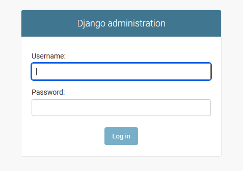
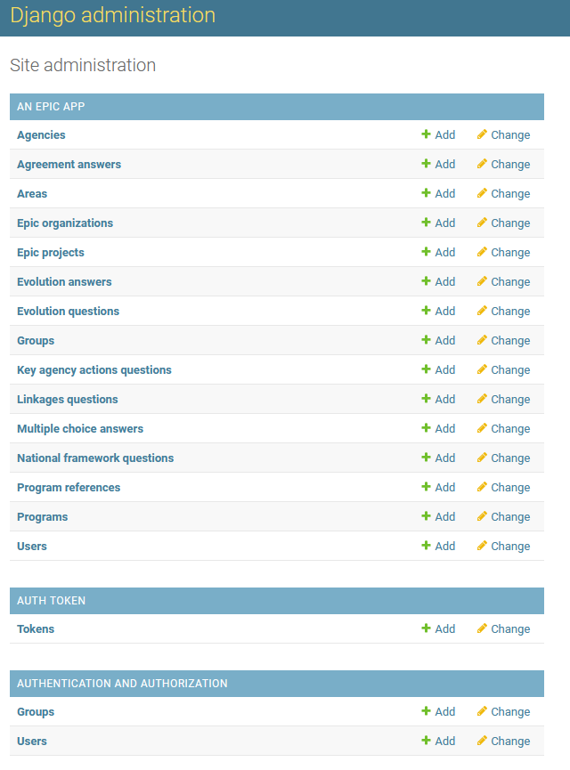
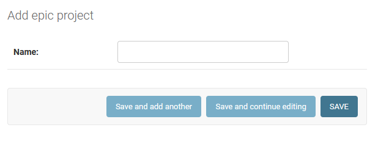
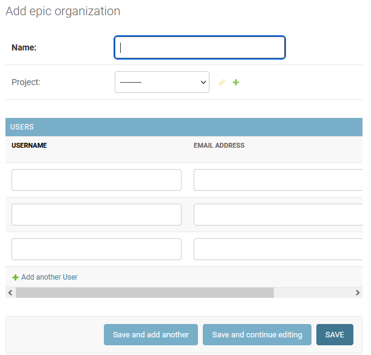
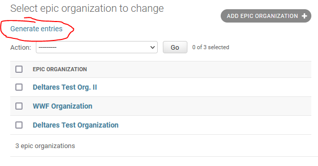
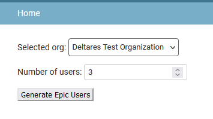
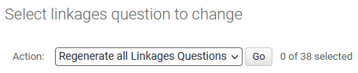
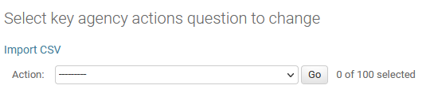
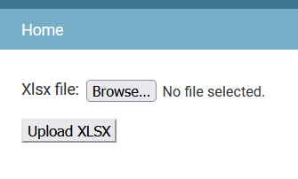

# Admin backend.

As a `Django` application, we can log in its backend to manage the different tables created during [deployment](api_deployment.md) 

## Logging to the admin site.

To do so we need to add the `/admin` suffix to our **base** url. For instance, if our page is `www.myepicreport.nl`, we will add www.`myepicreport.nl/admin` to access the admin backend (Image 1).

Use your admin credentials to log in and you will be redirected to the admin control panel (Image 2).

The site administration should display three categories:
    
- "An epic app". Contains all the models (tables) defined in the Django backend which have been migrated into the database. 
- "Auth Token". Contains all the generated authentication tokes for registered users. An authentication token **is required** for the frontend to interact with the API.
- "Authentication and Authorization". Django inherited tables. We don't use them except when creating a new `admin` user (which is not necessarily an `epic user`).

|Image 1. Django admin log in page|
|:--:|
||

|Image 2. Django admin control panel|
|:--:|
||

## Creating an "Epic Project"
To create a new `EpicProject` (Image 3) simply access `admin/epic_app/epicproject` and then the "Add epic project +" button. Or you can simply click the`Add` button in the site administration table.

A new `EpicProject` can also be created while [creating an organization](#creating-an-organization)

|Image 3. Add epic project|
|:--:|
||

## Creating an Organization
To create a new `EpicOrganization` (Image 4) simply access `admin/epic_app/epicorganization` and then the "Add epic organization +". Or you can simply click the `Add` button in the site administration table.

Note that while creating an organization you will have to select a project. If your project hasn't been created yet you can do it now by simply clicking in the + next to the Project field.

You can also create new users, however **this is not adviced**, as you'll have to generate on a different page their passwords. Otherwise it won't be possible to log in. Instead, follow the steps in the following subsection  [Generating users](#generating-users)

|Image 4. Add epic organization|
|:--:|
||

### Generating users
In the list of Epic Organizations (`admin/epic_app/epicorganization`) you will find all created organizations (Image 5). In addition you will see a link "`Generate entries`" clik on it and you will be redirect to a new page with a simple form (Image 6).
In this form you will have to select:
- Selected org. One of the existing organizations (among all the projects) that will contain the users to create.
- Number of users. Users to be generated.

After filling the form, and clicking "Generate epic users" you will be redirected again to the list of epic organizations. On the top of the page a notification will display the names of the selected organization and the added users (Image 7). By default, their passwords will be their usernames **in lowercase**.

|Image 5. List epic organization|
|:--:|
||

|Image 6. Form generate users|
|:--:|
||

|Image 7. List epic organization with added users|
|:--:|
||

## Creating users
Although we advice to [generate users from the organization](#generating-users) it is still possible to manually create new users. In a similar way to the previous entries.

## Adding / Updating questions.

Epic app relies strongly in the different questions being added to generate the different reports. These questions, and their type of answers, are divided in the following tables:

- National framework questions / agreement answers.
- Evolution questions / evolution answers.
- Key agency questions / agreement answers.
- Linkages questions / multiple choice answers.

To update the questions you can do it manually by going to their respective "list" view, for instance `admin/epic_app/keyagencyactionsquestion/` for the Key agency questions. From the list, select a question and modify any of its fields.

### Generating linkages questions.
Linkages questions are quite particular as they have one entry per each `Program` entry. To generate them you will need to select the action "Regenerate all Linkages Questions" and then click "Go". This action will remove also all the related answers ([deleting entries](#deleting-entries)).

Important! If no linkages are present you won't be able to select this action. A simple workaround is to manually create a "dummy" entry and then the action will be available, said entry will be removed as explained earlier.

|Image 8. Regenerate linkages|
|:--:|
||

## Import XLSX
Our backend offers the possibility to update some tables providing an `xlsx` file (this will [delete the previous entries](#deleting-entries)). This applies for the following tables:

- Areas. This will also update the `Programs` and `Groups` tables!
- Agencies.
- National framework questions.
- Evolution questions.
- Key agency questions.

This functionality is present via the link "Import CSV" in their list view (Image 9) (yes, the button should be changed to XLSX instead of CSV previous approach). By clicking it you will be redirected to a simple form that allows you to select and upload the `xlsx` file with the new / updated questions (Image 10).

|Image 9. Import XLSX option|
|:--:|
||

|Image 10. Import XLSX form|
|:--:|
||

As a reference, when using the existing test data, these are the expected files for each question type:

- Areas -> initial_epic_data.xlsx
- Agencies -> agency_data.xlsx
- National framework questions -> nationalframeworkquestions.xlsx
- Evolution questions -> evolutionquestions.xlsx
- Key agency questions -> keyagencyactionsquestions.xlsx
- Linkages questions. These questions are generated in a different way (check [Generating linkages questions](#generating-linkages-questions))

## Updating all tables at once.

It is possible to update all tables at once by using the `Django CLI` commands. You can do that by using the test data files (it expects exactly those file names for each type) and the command `import_epic_domain`:

`poetry python manage.py import_epic_domain epic_app/tests/test_data/xlsx`

## Deleting entries.

By default Django tables will delete on CASCADE, this means that if there are strong relationships being used on a given entry they will also be deleted.